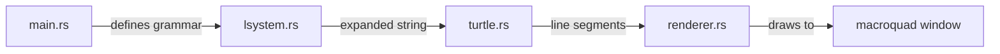
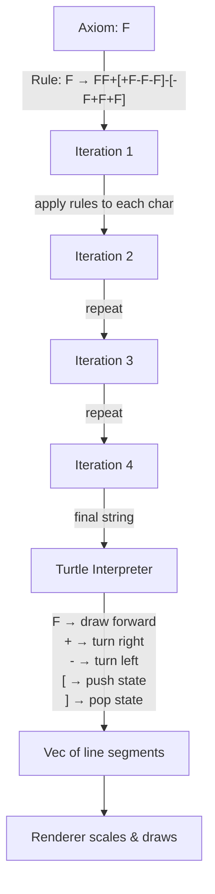

# L-System Tree — Architecture

## Module Flow

```mermaid
flowchart LR
    A[main.rs] -->|defines grammar| B[lsystem.rs]
    B -->|expanded string| C[turtle.rs]
    C -->|line segments| D[renderer.rs]
    D -->|draws to| E[macroquad window]
```

## Expansion Pipeline

```mermaid
flowchart TD
    A["Axiom: F"] -->|"Rule: F → FF+[+F-F-F]-[-F+F+F]"| B["Iteration 1"]
    B -->|apply rules to each char| C["Iteration 2"]
    C -->|repeat| D["Iteration 3"]
    D -->|repeat| E["Iteration 4"]
    E -->|final string| F["Turtle Interpreter"]
    F -->|"F → draw forward\n+ → turn right\n- → turn left\n[ → push state\n] → pop state"| G["Vec of line segments"]
    G --> H["Renderer scales & draws"]
```
